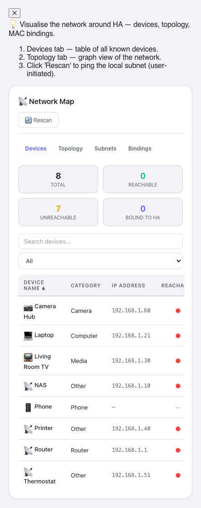

# Network Map


Visualize the devices Home Assistant already knows about, and probe their reachability from the Home Assistant host itself — not from the browser.

[](https://www.home-assistant.io/) [](LICENSE) [](https://github.com/MacSiem/ha-network-map/releases)

## Screenshot



## Architecture

This repository ships a single HACS integration that bundles two paired components, both maintained by the same author:

| Component | Location | Role |
|---|---|---|
| Python integration | `custom_components/ha_network_map/` | Reads HA's device registry, entity registry, `device_tracker.*` states, and (where available) Zeroconf / DHCP discovery caches. Probes TCP reachability from the HA host. Exposes a WebSocket API for the card. |
| Lovelace card | `custom_components/ha_network_map/www/ha-network-map.js` | Calls the integration's WS API. Auto-registered as a frontend resource on integration setup; no manual Lovelace resource entry needed. |

## How the scan works

Active probing in v5 runs server-side from the Home Assistant host — the same machine HA itself is on — which is why it can give consistent answers regardless of where you're viewing the dashboard from (Nabu Casa Cloud, mobile data, hotel WiFi, etc.). The probe path is:

1. Discovery: the integration enumerates every device in HA's device registry plus every `device_tracker.*` entity, joining MAC addresses, IPs from `configuration_url`, and (where available) Zeroconf / DHCP cache entries.
2. Reachability probe (only when triggered by the user via the "Scan" button or the `ha_network_map.scan` service): TCP connect attempts from the HA host against a smart-home port set — `80, 443, 8123, 6053, 1883, 8883, 554, 22, 631` by default, configurable per call.
3. Scope guard: only RFC1918 / loopback / link-local addresses are probed unless `include_public_ips: true` is passed explicitly. Public addresses pulled in via `configuration_url` are listed but skipped at scan time.
4. Throttle: at most 16 concurrent TCP connect attempts (configurable, hard cap 64).
5. The card calls `ha_network_map/list_devices` over the standard HA WS connection to render results. There is no browser-side `fetch()` to LAN IPs — the v4 path that did this was withdrawn (see "Upgrade notes" below).

## Installation (HACS)

1. HACS → Integrations → ⋮ → **Custom repositories**. Add `https://github.com/MacSiem/ha-network-map` with category **Integration**.
2. Install **Network Map** and restart Home Assistant.
3. **Settings → Devices & services → Add Integration → Network Map**.
4. The Lovelace card is registered automatically. Add it to a dashboard:

   ```yaml
   type: custom:ha-network-map
   ```

If you previously installed v4 as a Lovelace plugin, remove the `/local/community/ha-network-map/...` resource entry under *Dashboards → Resources* — it is superseded by `/ha_network_map/ha-network-map.js` which the integration now serves.

## Features

- Visualize every device HA knows about, not just `device_tracker.*` entries — covers Bluetooth, Zigbee, Z-Wave, MQTT, ESPHome, and any integration that registers a device.
- Server-side TCP probe from the HA host, on smart-home-relevant ports (HTTP, HTTPS, HA, ESPHome, MQTT, RTSP, SSH, IPP).
- RFC1918 scope guard, concurrency cap, and a queue so concurrent scan calls coalesce.
- Bento Design System (light + dark, mobile-friendly), system font stack — no CDN font fetches.
- Optional sidebar panel via `panel_custom` (see below).

## Service

```yaml
service: ha_network_map.scan
data:
  ports: [80, 443, 8123]      # optional, defaults to a smart-home set
  timeout: 0.7                # optional, 0.05 .. 5.0 seconds
  max_concurrent: 16          # optional, 1 .. 64
  include_public_ips: false   # optional, default false
```

## Privacy

- All scanning happens on the Home Assistant host. The browser never fires HTTP probes against LAN IPs.
- Device data stays inside Home Assistant — the integration only reads HA's own registries and discovery caches.
- The card uses browser `localStorage` only for a small set of UI preferences (intro-dismissed marker and a user-supplied per-device label / "binding" map). No device or scan data is cached in the browser.
- No telemetry, no analytics, no CDN-hosted assets.

## Upgrade notes (4.x → 5.0)

5.0 is a clean break.

- The v4 card scanned the network from the browser. It iterated `/24` subnets and fired `fetch('http://IP:port/')` against `[80, 443, 8080, 8123]` for every IP. That probed *whatever LAN the user's browser was on* — typically not the home LAN when accessed via Nabu Casa Cloud or mobile data — and contradicted the README's "no external network calls" claim. v5 removes that path entirely and replaces it with the Python integration's server-side probe.
- The card resource URL changed from `/local/community/ha-network-map/ha-network-map.js` (v4 plugin install) to `/ha_network_map/ha-network-map.js` (integration-served). Remove the old Lovelace resource entry after upgrading.
- The legacy "Subnets" input still appears in the card settings tab for backward visual compatibility, but it does not affect scan scope in v5 — the integration owns scope. It will be removed in a later version.
- v4 cached scan results in `localStorage` under the key `ha-tools-net-scan`. v5 reads from the integration on every card load, so that cache is no longer consulted.

## Changelog

See [CHANGELOG.md](CHANGELOG.md).

## License

MIT — see [LICENSE](LICENSE).
