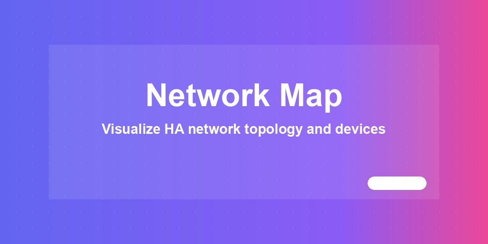
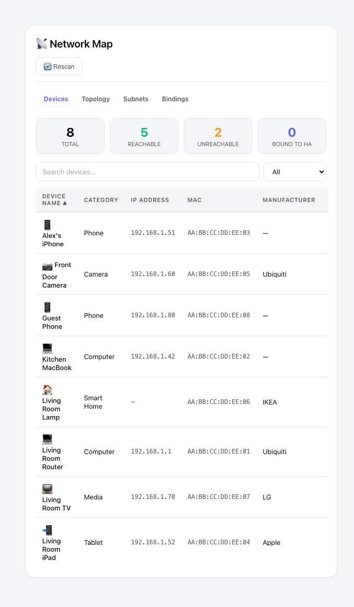
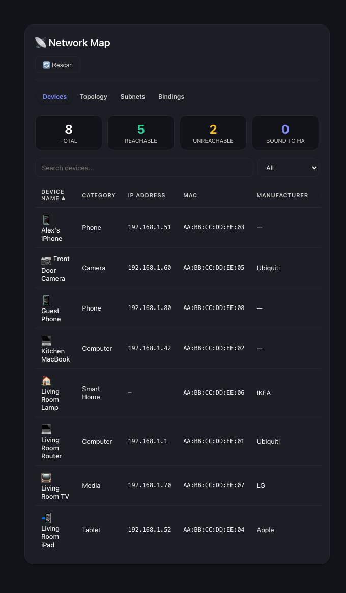

# Network Map



Visualize the devices Home Assistant already knows about, and probe their
reachability from the Home Assistant host itself — not from your browser.
Ships as a Home Assistant integration with a bundled Lovelace card; no manual
resource entry required.

[](https://www.home-assistant.io/) [](https://github.com/MacSiem/ha-network-map/releases) [](LICENSE)

Part of the [HA Tools](https://github.com/MacSiem) ecosystem.

## How it works

**Short version: install the integration, add the card, browse.**

1. **Discovery is read-only and server-side.** The bundled Python integration
   reads devices straight from Home Assistant's own device registry, entity
   registry, `device_tracker.*` states, and — where available — Zeroconf /
   DHCP discovery caches. No browser-side enumeration, ever.
2. **The card is bundled and auto-registered.** The integration serves
   `ha-network-map.js` as a static path and registers it as a frontend
   resource on setup (cache-busted by the integration version) — you only add
   `custom:ha-network-map` to a dashboard.
3. **Reachability is probed from the HA host, not your browser.** TCP connect
   attempts against a smart-home port set (`80, 443, 8123, 6053, 1883, 8883,
   554, 22, 631` by default) run from the Home Assistant host, so results are
   consistent no matter where you're viewing the dashboard from (Nabu Casa
   Cloud, mobile data, hotel WiFi). Only RFC1918 / loopback / link-local
   addresses are probed unless `include_public_ips` is explicitly set.
4. **Reading the map is open to every logged-in user; scanning is admin-only.**
   `ha_network_map/list_devices` and `ha_network_map/status` are plain
   WebSocket commands with no admin requirement, so the card renders device
   data for non-admin household members too. `ha_network_map/scan` requires
   an administrator account, because it actively opens TCP connections
   against devices on your network.

### What is automatic vs. manual

| Automatic | Manual |
|---|---|
| Card JS registration (no Lovelace resource entry needed) | Adding the integration once (Settings → Devices & services) |
| Device discovery from HA's registries (all users can view it) | Triggering a scan (admin-only — button, service, or automation) |
| Reachability scope guard (RFC1918 / loopback / link-local only) | Enabling `include_public_ips` if you understand the implications |
| Cache-busting the card on integration upgrades | Adding `custom:ha-network-map` to a dashboard |

## Screenshots

| Light | Dark |
|---|---|
|  |  |

*The Devices tab: per-device reachability, MAC/IP, manufacturer and any bound
HA entity. The Topology tab renders the same devices as a hub-and-spoke graph.
Dark mode follows your Home Assistant theme automatically.*

## Installation

1. Open HACS → Integrations → ⋮ → **Custom repositories**.
2. Add `https://github.com/MacSiem/ha-network-map` with category
   **Integration**.
3. Install **Network Map** and restart Home Assistant.
4. **Settings → Devices & services → Add Integration → Network Map** (single
   instance, no fields to fill in).
5. The Lovelace card is registered automatically — no resource entry needed.

If you previously installed v4 as a Lovelace plugin, remove the old
`/local/community/ha-network-map/...` resource entry under *Dashboards →
Resources* — it's superseded by `/ha_network_map/ha-network-map.js`, which
the integration now serves.

## Quick start

```yaml
type: custom:ha-network-map
```

That's it — no options are required. Optionally set a `title` or
`router_ip` (used only as the label under the topology hub):

```yaml
type: custom:ha-network-map
title: Network Map
router_ip: 192.168.1.1
```

## Entities

This integration exposes **no entities**. It is a WebSocket API + bundled
Lovelace card only — there are no `sensor.*` or `binary_sensor.*` platforms.
Device and reachability data live in the integration's in-memory state and
are read by the card over three WebSocket commands:

| WebSocket command | Access | Description |
|---|---|---|
| `ha_network_map/list_devices` | Any logged-in user | Current device map, no network probe |
| `ha_network_map/status` | Any logged-in user | Last-scan timestamps + device/reachable counts |
| `ha_network_map/scan` | Admin only | Triggers a fresh TCP reachability probe from the HA host |

## Services

### `ha_network_map.scan`

Probe TCP reachability for every HA-known device with an IP, from the Home
Assistant host itself.

```yaml
service: ha_network_map.scan
data:
  ports: [80, 443, 8123]      # optional, defaults to a smart-home set
  timeout: 0.7                # optional, 0.05 .. 5.0 seconds
  max_concurrent: 16          # optional, 1 .. 64
  include_public_ips: false   # optional, default false
```

Only private addresses (RFC1918 / loopback / link-local) are probed unless
`include_public_ips` is enabled. A scan already in progress causes new calls
to return the current status instead of running twice. A single scan probes
at most 256 devices (`DEFAULT_MAX_DEVICES_PER_SCAN`); on larger networks the
remaining devices are skipped for that run.

## Automation example

```yaml
alias: Nightly network scan
trigger:
  - platform: time
    at: "03:00:00"
action:
  - service: ha_network_map.scan
    data:
      timeout: 1.0
      max_concurrent: 8
```

## Privacy

- All active probing happens on the Home Assistant host. The browser never
  fires TCP/HTTP probes against LAN IPs.
- Only RFC1918 / loopback / link-local addresses are probed by default —
  scanning does not leave your LAN unless you explicitly set
  `include_public_ips: true` on a call, and even then the connection
  originates from the HA host, not a third-party service.
- Device data stays inside Home Assistant — the integration only reads HA's
  own registries and discovery caches; nothing is sent externally.
- The card uses browser `localStorage` only for a small set of UI
  preferences (intro-dismissed marker and a user-supplied per-device label /
  "binding" map). No device or scan data is cached in the browser.
- No telemetry, no analytics, no CDN-hosted assets.

## FAQ

**Does scanning leave my LAN?**
No. The scanner only probes RFC1918 / loopback / link-local addresses unless
you explicitly pass `include_public_ips: true`, and every probe originates
from the Home Assistant host itself — never from your browser.

**Can non-admin users see the device map?**
Yes, as of 5.0.7. `list_devices` and `status` are open to every logged-in
user, so the card renders for the whole household. Only triggering a new
scan requires an administrator account.

**Why do I only see `device_tracker.*` devices, not my Zigbee/Bluetooth
gear?**
You shouldn't — the integration reads the full device registry server-side,
so Bluetooth, Zigbee, Z-Wave, MQTT, ESPHome, and any other integration that
registers a device all show up, not just `device_tracker.*` entities. Devices
without an IP (most Zigbee/Z-Wave/serial gear) show `—` for reachability
instead of being flagged unreachable, since they were never scannable.

**A device reachability shows "unreachable" even though it's online.**
A device only counts as unreachable when every probed port times out with no
response at all. A refused connection still proves the host is up, so most
IoT devices, printers and Modbus gear that expose none of the scanned ports
still show as reachable.

**Does this send data anywhere?**
No. Everything stays inside your Home Assistant instance — no telemetry, no
CDN assets, no external network calls beyond the probes you trigger against
your own LAN.

## Changelog

See [CHANGELOG.md](CHANGELOG.md).

## Support

If this tool makes your Home Assistant life easier, consider supporting
development:

- [Buy Me a Coffee](https://buymeacoffee.com/macsiem)
- [PayPal](https://www.paypal.com/donate/?hosted_button_id=Y967H4PLRBN8W)

## License

MIT — see [LICENSE](LICENSE).
