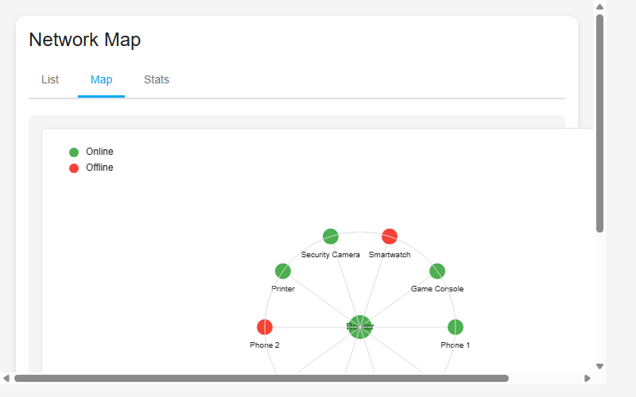
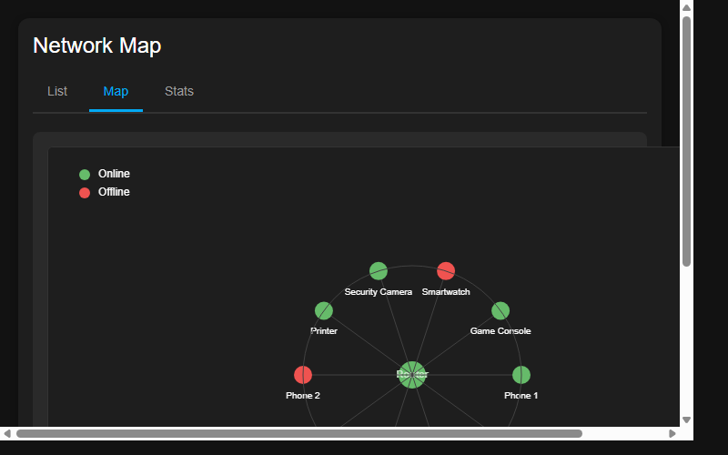

# Home Assistant Network Map

[](https://github.com/MacSiem/ha-network-map/actions/workflows/validate.yml)
[](https://github.com/hacs/integration)

A Lovelace card for Home Assistant that visualizes your home network devices with interactive list, map, and statistics views.



## Features

- List view with searchable device table (name, category, status, IP, MAC, last seen)
- Network map visualization showing device connections as a radial graph
- Statistics dashboard with online/offline device counts and bandwidth monitoring
- Device categorization (Phone, Tablet, Computer, Media, Smart Home, Wearable)
- Click-to-detail interaction on network map
- Sort by device name, category, or status
- Light and dark theme support
- Automatic device discovery from Home Assistant device tracker entities

## Installation

### HACS (Recommended)

1. Open HACS in your Home Assistant
2. Go to Frontend → Explore & Download Repositories
3. Search for "Network Map"
4. Click Download

### Manual

1. Download `ha-network-map.js` from the [latest release](https://github.com/MacSiem/ha-network-map/releases/latest)
2. Copy it to `/config/www/ha-network-map.js`
3. Add the resource in Settings → Dashboards → Resources:
   - URL: `/local/ha-network-map.js`
   - Type: JavaScript Module

## Usage

Add the card to your dashboard:

```yaml
type: custom:ha-network-map
title: Network Map
router_entity: device_tracker.router
```

### Configuration

| Option | Type | Default | Description |
|--------|------|---------|-------------|
| `type` | string | required | `custom:ha-network-map` |
| `title` | string | `Network Map` | Card title |
| `router_entity` | string | `device_tracker.router` | Entity ID of the router/gateway device |

## Screenshots

| Light Theme | Dark Theme |
|:-----------:|:----------:|
|  |  |

## How It Works

The card automatically discovers all `device_tracker.*` entities in your Home Assistant instance and displays them across three views:

**List View** shows a searchable table of all devices with sortable columns for name, category, status, IP address, MAC address, and last seen timestamp.

**Map View** renders an interactive radial network visualization with the router at the center and connected devices positioned around it. Device nodes are color-coded by status (green = home/online, red = away/offline, gray = unknown). Click any device node to see detailed information.

**Stats View** displays aggregate statistics including total device count, online/offline device counts, and real-time bandwidth usage if bandwidth sensor entities are available.

Device names are automatically categorized based on keywords (e.g., "phone" → Phone category, "laptop" → Computer category).

## Requirements

- Home Assistant with device_tracker entities configured
- Home Assistant 2021.12 or later
- Lovelace dashboard with custom card support

## License

MIT License - see [LICENSE](LICENSE) file.
