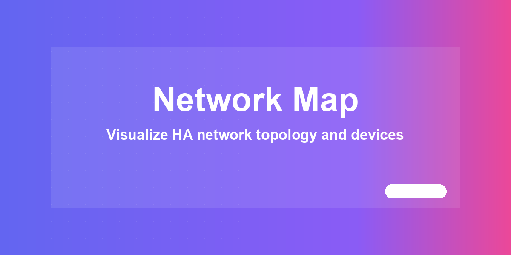
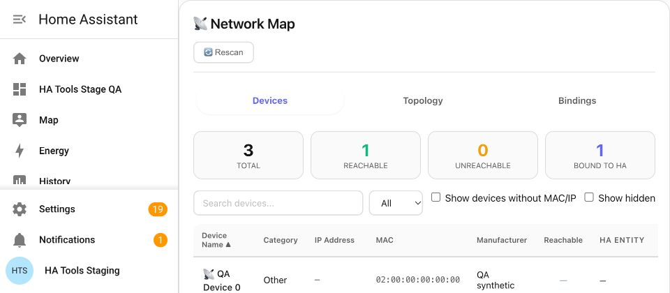
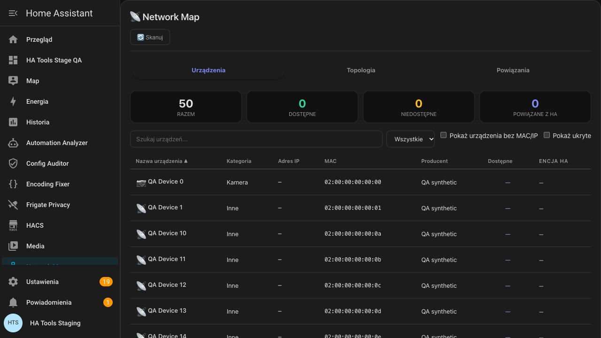

# Network Map



Visualize the devices Home Assistant already knows about, and probe their
reachability from the Home Assistant host itself — not from your browser.
Ships as a Home Assistant integration with a bundled Lovelace card; no manual
resource entry required.

[](https://www.home-assistant.io/) [](https://github.com/MacSiem/ha-network-map/releases) [](LICENSE)

Part of the [HA Tools](https://github.com/MacSiem) ecosystem.

## How it works

**Short version: install the integration, add the card, browse.**

1. **Discovery is read-only and server-side.** The bundled Python integration
   reads HA's device and entity registries, `device_tracker.*` states and, where
   available, Zeroconf / DHCP discovery caches. By default it shows only
   devices with a MAC or IP address. HACS repository and service entries with
   no connection are excluded. The optional filter shows Bluetooth, Zigbee
   and other entries with an explicit connection but no network address.
2. **The card is bundled and auto-registered.** The integration serves
   `ha-network-map.js`, registers a storage-mode Lovelace resource and an
   administrator-only sidebar panel. YAML mode uses Home Assistant's frontend
   fallback. You can also add `custom:ha-network-map` to a dashboard.
3. **Reachability is probed from the HA host, not your browser.** TCP connect
   attempts against a smart-home port set (`80, 443, 8123, 6053, 1883, 8883,
   554, 22, 631` by default) run from the Home Assistant host, so results are
   consistent no matter where you're viewing the dashboard from (Nabu Casa
   Cloud, mobile data, hotel WiFi). Only RFC1918 / loopback / link-local
   addresses are probed unless `include_public_ips` is explicitly set.
4. **Reading the map is open to every logged-in user; scanning is admin-only.**
   `ha_network_map/list_devices` and `ha_network_map/status` are plain
   WebSocket commands with no admin requirement, so the card renders device
   data for non-admin household members too. `ha_network_map/scan` requires
   an administrator account, because it actively opens TCP connections
   against devices on your network.

### What is automatic vs. manual

| Automatic | Manual |
|---|---|
| Card JS registration (no Lovelace resource entry needed) | Adding the integration once (Settings → Devices & services) |
| Device discovery from HA's registries (all users can view it) | Triggering a scan (admin-only — button, service, or automation) |
| Reachability scope guard (RFC1918 / loopback / link-local only) | Enabling `include_public_ips` if you understand the implications |
| Cache-busting the card on integration upgrades | Adding `custom:ha-network-map` to a dashboard |
| Default MAC/IP filtering | Showing non-network connection types, hiding a device or changing its category |

Hidden devices and category choices use the HA Device Registry ID where
available, so an IP change does not lose the choice. The card links to the
HA device and entity pages. These choices are stored in this browser's
`localStorage`; they do not sync between browsers or household members.

## Screenshots

| Light | Dark |
|---|---|
|  |  |

*Captured from 5.0.19 running in Home Assistant with synthetic QA devices.
The English light view uses actual Chrome zoom at 200%; the Polish dark view
uses the normal wide layout. These screenshots contain no household data.
The Topology tab renders the same devices as a hub-and-spoke graph. Dark mode
follows your Home Assistant theme.*

Table headers support keyboard sorting, and topology nodes expose their full
names when focused. The card supports English and Polish, including categories,
pagination and scan status.

## Installation

1. Open HACS → Integrations → ⋮ → **Custom repositories**.
2. Add `https://github.com/MacSiem/ha-network-map` with category
   **Integration**.
3. Install **Network Map** and restart Home Assistant.
4. **Settings → Devices & services → Add Integration → Network Map** (single
   instance, no fields to fill in).
5. Administrators can open **Network Map** in the sidebar. The Lovelace card is
   registered automatically — no resource entry needed.

Network Map is also available in the default HACS Integration catalog.
Search for **Network Map**; custom repository registration is optional.

If you previously installed v4 as a Lovelace plugin, remove the old
`/local/community/ha-network-map/...` resource entry under *Dashboards →
Resources* — it's superseded by `/ha_network_map/ha-network-map.js`, which
the integration now serves.

## Quick start

```yaml
type: custom:ha-network-map
```

That's it — no options are required. Optionally set a `title` or
`router_ip` (used only as the label under the topology hub):

```yaml
type: custom:ha-network-map
title: Network Map
router_ip: 192.168.1.1
```

## Entities

This integration exposes **no entities**. It is a WebSocket API + bundled
Lovelace card only — there are no `sensor.*` or `binary_sensor.*` platforms.
Device and reachability data live in the integration's in-memory state and
are read by the card over three WebSocket commands:

| WebSocket command | Access | Description |
|---|---|---|
| `ha_network_map/list_devices` | Any logged-in user | Current device map, no network probe |
| `ha_network_map/status` | Any logged-in user | Last-scan timestamps + device/reachable counts |
| `ha_network_map/scan` | Admin only | Triggers a fresh TCP reachability probe from the HA host |

## Services

### `ha_network_map.scan`

Probe TCP reachability for every HA-known device with an IP, from the Home
Assistant host itself.

```yaml
service: ha_network_map.scan
data:
  ports: [80, 443, 8123]      # optional, defaults to a smart-home set
  timeout: 0.7                # optional, 0.05 .. 5.0 seconds
  max_concurrent: 16          # optional, 1 .. 64
  include_public_ips: false   # optional, default false
```

Only private addresses (RFC1918 / loopback / link-local) are probed unless
`include_public_ips` is enabled. A scan already in progress causes new calls
to return the current status instead of running twice. A single scan probes
at most 256 devices (`DEFAULT_MAX_DEVICES_PER_SCAN`); on larger networks the
remaining devices are skipped for that run.

A request accepts at most 12 TCP ports. An unmeasured device shows `—`, including
devices without an IP and public addresses skipped by the default scope guard.
Scan results and timestamps are held in memory and reset when the integration
is reloaded or Home Assistant restarts. A temporary list error preserves the
existing map and offers **Retry**, which only reads the device list and does
not start a scan.

Use active scans only for devices and networks you administer. Reachability is
an informational check, not a security assessment or a guarantee of availability.

## Automation example

```yaml
alias: Nightly network scan
trigger:
  - platform: time
    at: "03:00:00"
action:
  - service: ha_network_map.scan
    data:
      timeout: 1.0
      max_concurrent: 8
```

## Privacy and data

- All active probing happens on the Home Assistant host. The browser never
  fires TCP/HTTP probes against LAN IPs.
- Only RFC1918 / loopback / link-local addresses are probed by default —
  scanning does not leave your LAN unless you explicitly set
  `include_public_ips: true` on a call, and even then the connection
  originates from the HA host, not a third-party service.
- Device names, addresses, categories and entity links come from Home Assistant's
  registries, states and optional discovery caches. Reading the map sends no
  data to a third-party service. Every logged-in household user can read it.
- Explicit scans open TCP connections from the HA host. Enabling
  `include_public_ips: true` also permits connections to public addresses;
  the destination then sees the HA host's network address. No application
  payload, credentials or telemetry are sent by the probe.
- The card uses browser `localStorage` for intro dismissal, bindings, hidden
  device IDs and categories. Scan results are not persisted in the browser.
- No telemetry, no analytics, no CDN-hosted assets.

## FAQ

**Does scanning leave my LAN?**
No. The scanner only probes RFC1918 / loopback / link-local addresses unless
you explicitly pass `include_public_ips: true`, and every probe originates
from the Home Assistant host itself — never from your browser.

**Can non-admin users see the device map?**
Yes, as of 5.0.7. `list_devices` and `status` are open to every logged-in
user, so the card renders for the whole household. Only triggering a new
scan requires an administrator account.

**Why are my Zigbee/Bluetooth devices absent by default?**
The map starts with MAC/IP devices. Select **Show devices without MAC/IP** to
include entries with an explicit connection type, such as Zigbee or Bluetooth.
Addressless service entries stay excluded. Devices without an IP show `—` for
reachability because they cannot be probed.

**A device reachability shows "unreachable" even though it's online.**
A device only counts as unreachable when every probed port times out with no
response at all. A refused connection still proves the host is up, so most
IoT devices, printers and Modbus gear that expose none of the scanned ports
still show as reachable.

**Does this send data anywhere?**
No. Reading the map stays within Home Assistant. There is no telemetry or CDN
asset loading. An explicit scan connects to local addresses by default;
`include_public_ips: true` also permits connections to public addresses.

## Changelog

See [CHANGELOG.md](CHANGELOG.md).

## Support

If this tool makes your Home Assistant life easier, consider supporting
development:

- [Buy Me a Coffee](https://buymeacoffee.com/macsiem)
- [PayPal](https://www.paypal.com/donate/?hosted_button_id=Y967H4PLRBN8W)

The card shows a small support link to administrators. It can be dismissed in the browser or hidden with `show_support: false` in the card configuration.

## License

MIT — see [LICENSE](LICENSE).
